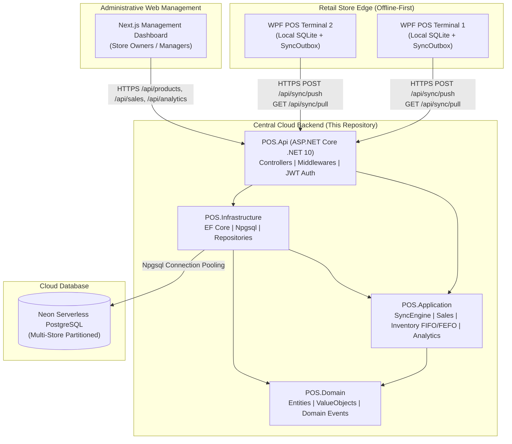
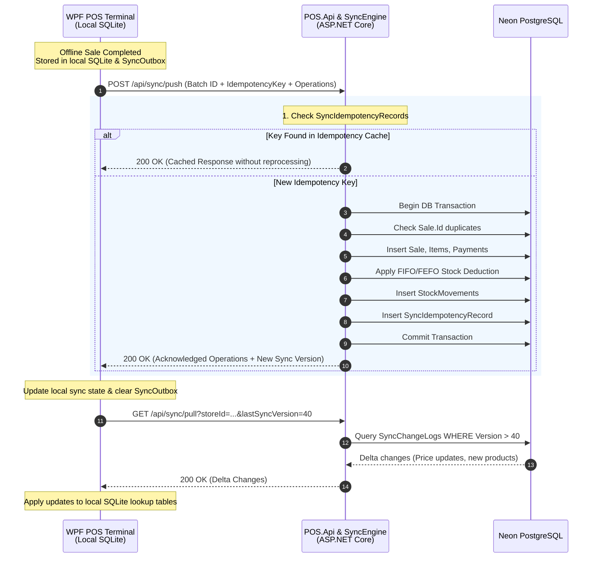

# POS-API: Central Point of Sale Web API (.NET 10)

Production-grade, modular ASP.NET Core Web API serving as the central transactional and analytical backend for a modern multi-store Point of Sale (POS) ecosystem.

---

## 1. System Ecosystem & Architecture

The POS platform is architected into three distinct applications with strict boundary isolation:

1. **POS-Desktop (WPF / SQLite)**: Offline-first desktop POS client running on store cash registers. Operates locally with zero internet dependency and synchronizes pending sales and transactions with this API when connectivity is present.
2. **POS-API (This Repository - ASP.NET Core / Neon PostgreSQL)**: Central multi-tenant/multi-store backend handling authentication, change-based synchronization, inventory (FIFO/FEFO), sales, employee management, and read-optimized analytics.
3. **POS-Web (Next.js Dashboard)**: Management and administrative web portal for store owners and back-office staff. **Exclusively** interacts with this Web API over HTTPS and never connects directly to PostgreSQL.



---

## 2. Project Structure

The solution follows Clean Architecture and Domain-Driven Design (DDD) principles:

```text
POS-API/
├── src/
│   ├── POS.Domain/                      # Core enterprise entities, business rules, enums, value objects
│   │   ├── Common/                      # BaseEntity, IAggregateRoot, IAuditableEntity
│   │   ├── Entities/                    # Store, PosTerminal, User, Role, Sale, Product, Stock, SyncLog
│   │   ├── Enums/                       # SaleStatus, PaymentMethod, StockMovementType, UserStatus
│   │   ├── Events/                      # SaleCompletedDomainEvent, StockMovementRecordedDomainEvent
│   │   ├── Exceptions/                  # InsufficientStockException, DuplicateEntityException, SyncConflictException
│   │   ├── Interfaces/                  # ISaleRepository, IStockRepository, ISyncRepository, IUnitOfWork
│   │   └── ValueObjects/                # Money, Address, BarcodeValue
│   │
│   ├── POS.Application/                 # Application use cases, DTOs, orchestration, validation
│   │   ├── Analytics/                   # Dashboard summary, sales trends, top-selling query services
│   │   ├── Authentication/              # Login, token refresh, password hashing use cases
│   │   ├── Common/                      # Permissions constants, ApiResponse, PagedResult, Result models
│   │   ├── Customers/                   # Customer management and loyalty tracking
│   │   ├── Employees/                   # Employee management, status transitions, store assignments
│   │   ├── Inventory/                   # Stock adjustment, batch receiving, FIFO/FEFO allocation strategies
│   │   ├── Products/                    # Product catalog, multi-barcode support, category tree
│   │   ├── Reports/                     # Sales and inventory valuation report generators
│   │   ├── Sales/                       # Transactional sale creation, voiding, and total calculation
│   │   └── Synchronization/             # Change tracking, push/pull synchronization engine, conflict handling
│   │
│   ├── POS.Infrastructure/              # Persistence, database access, external service integrations
│   │   ├── Authentication/              # JwtTokenGenerator, BCrypt PasswordHasher, CurrentUserService
│   │   ├── Persistence/
│   │   │   ├── AppDbContext.cs          # EF Core DbContext with audit interceptors and query filters
│   │   │   ├── Configurations/          # IEntityTypeConfiguration<T> mappings with PostgreSQL types
│   │   │   ├── Migrations/              # EF Core database schema migrations
│   │   │   └── Seed/                    # DatabaseSeeder for roles, permissions, stores, and superadmin
│   │   ├── Repositories/                # GenericRepository, SaleRepository, StockRepository, SyncRepository
│   │   └── Services/                    # DateTimeProvider
│   │
│   └── POS.Api/                         # API presentation layer
│       ├── Configuration/               # JwtSettings, CorsSettings, ApiSettings
│       ├── Controllers/                 # REST controllers (Auth, Sync, Sales, Products, Inventory, Analytics, etc.)
│       ├── Extensions/                  # Swagger, JWT, Serilog, Authorization policy extensions
│       ├── Filters/                     # AuthorizePermissionAttribute, PermissionAuthorizationHandler
│       ├── Middleware/                  # ExceptionHandling (ProblemDetails), CorrelationId, RequestLogging
│       ├── Program.cs                   # Application entry point and pipeline configuration
│       ├── appsettings.json             # Production configuration
│       └── appsettings.Development.json # Development configuration
│
├── tests/
│   ├── POS.UnitTests/                   # Domain rule tests, totals calculation, FIFO/FEFO allocation
│   ├── POS.ApplicationTests/            # AuthService, SyncEngineService, SaleService use case tests
│   └── POS.IntegrationTests/            # End-to-end API tests, retry idempotency, multi-transaction sync
│
├── .github/workflows/ci.yml             # GitHub Actions CI/CD pipeline
├── Dockerfile                           # Multi-stage production container build
├── .dockerignore
├── .gitignore
├── POS-API.slnx
└── README.md
```

---

## 3. Configuring Neon PostgreSQL

1. Log into your [Neon Console](https://console.neon.tech) and create a new PostgreSQL project.
2. Copy your connection string from the Neon dashboard (ensure `sslmode=require` is present).
3. Set the connection string in your local `appsettings.Development.json` or as an environment variable:

```json
{
  "ConnectionStrings": {
    "DefaultConnection": "Host=ep-xyz-123456.us-east-2.aws.neon.tech;Database=neondb;Username=your_username;Password=your_password;SSL Mode=Require;Trust Server Certificate=true"
  }
}
```

---

## 4. Environment Variables

| Variable | Description | Example / Default |
| :--- | :--- | :--- |
| `ConnectionStrings__DefaultConnection` | Neon PostgreSQL connection string | `Host=...;Database=...;Username=...;Password=...;SSL Mode=Require` |
| `Jwt__SecretKey` | HMAC-SHA256 signing secret (min 32 bytes) | `SUPER_SECRET_KEY_MINIMUM_32_CHARACTERS` |
| `Jwt__Issuer` | JWT Token Issuer | `POS-API` |
| `Jwt__Audience` | JWT Token Audience | `POS-Clients` |
| `Jwt__ExpiryMinutes` | Access token lifespan | `120` |
| `Cors__AllowedOrigins__0` | Next.js Dashboard allowed origin | `http://localhost:3000` |
| `ASPNETCORE_ENVIRONMENT` | Environment name | `Production` or `Development` |

---

## 5. How to Run Locally

### Prerequisites
- [.NET 10 SDK](https://dotnet.microsoft.com/download/dotnet/10.0)

### Steps
```bash
# Clone the repository
git clone https://github.com/your-org/pos-asp-api.git
cd pos-asp-api

# Restore dependencies
dotnet restore POS-API.slnx

# Run the API
dotnet run --project src/POS.Api/POS.Api.csproj
```

The API will start and serve Swagger UI at `http://localhost:5000/` or `https://localhost:5001/` in development mode.

---

## 6. Creating and Applying Database Migrations

### Prerequisites
Install the `dotnet-ef` global tool:
```bash
dotnet tool install --global dotnet-ef
```

### Create a new migration:
```bash
dotnet ef migrations add AddNewFeature \
  --project src/POS.Infrastructure \
  --startup-project src/POS.Api \
  -o Persistence/Migrations
```

### Apply migrations to Neon PostgreSQL:
```bash
dotnet ef database update \
  --project src/POS.Infrastructure \
  --startup-project src/POS.Api
```

> **Note**: In production and on application startup, the built-in `DatabaseSeeder` automatically invokes `await context.Database.MigrateAsync()` to ensure the Neon PostgreSQL schema is up-to-date.

---

## 7. Authentication & Authorization

### Authentication Flow
1. Client submits credentials to `POST /api/auth/login`.
2. API validates BCrypt password hash and checks user active status.
3. API returns:
   - `accessToken`: Short-lived JWT bearer token with embedded Claims (Store ID, Terminal ID, Roles, Permissions).
   - `refreshToken`: Cryptographically secure random token stored with rotation metadata in PostgreSQL.
4. Client attaches `Authorization: Bearer <token>` to all protected endpoints.
5. Client refreshes token before expiration via `POST /api/auth/refresh`.

### Permissions Matrix
Authorization is enforced server-side using policies derived from individual granular permissions:

- `Permissions.Dashboard.View`: Access analytics and dashboards.
- `Permissions.Sales.Process`: Authorize POS terminals to process sales.
- `Permissions.Sales.View`: Read sale records and receipts.
- `Permissions.Products.Manage`: Create, edit, and categorize products and barcodes.
- `Permissions.Inventory.Manage`: Stock adjustments, purchase batches, and movements.
- `Permissions.Employees.Manage`: Staff onboarding, role assignments, hourly rates.
- `Permissions.Customers.Manage`: Customer profiles and credit balance management.
- `Permissions.Sync.Execute`: Authorize offline POS synchronization endpoints.

---

## 8. Synchronization & Offline-First Strategy

The WPF desktop POS operates in a **local-first** mode against a local SQLite database. It generates records using GUID primary keys and enqueues transactions into a local `SyncOutbox`.



### Idempotency & Network Drop Resilience
A critical risk in distributed POS systems is the "lost response" scenario:
1. WPF POS sends a sale transaction to `POST /api/sync/push`.
2. Server commits the transaction to Neon PostgreSQL.
3. Network connection drops before the HTTP 200 OK response reaches the client.
4. WPF POS retries sending the same push batch with the identical `IdempotencyKey`.
5. **Protection**: `SyncEngineService` looks up the `SyncIdempotencyRecord` table, recognizes the key, skips duplicate transaction processing, and returns the cached success acknowledgment immediately.

---

## 9. Inventory Management: FIFO & FEFO

Inventory allocation logic is encapsulated in `IFifoFefoAllocationStrategy`:

- **FIFO (First-In, First-Out)**: Allocates inventory from batches sorted by `ReceivedAtUtc ASC`.
- **FEFO (First-Expired, First-Out)**: Allocates inventory from batches sorted by `ExpiryDateUtc ASC`, ensuring perishable items are depleted before expiration.
- Every inventory modification produces an immutable `StockMovement` ledger entry for auditability.

---

## 10. Running the Automated Tests

The repository includes a comprehensive test suite covering Unit, Application, and Integration scenarios:

```bash
# Run all tests
dotnet test POS-API.slnx --logger "console;verbosity=detailed"
```

### Key Tested Scenarios:
1. **Duplicate Sale Retry / Network Loss**: Verifies that when a POS terminal retries a sale push batch after a simulated network disconnect, the API returns the cached response and does not duplicate sales or inventory deductions in PostgreSQL.
2. **Multi-Transaction Batch Push**: Verifies that composite transactions containing multiple distinct entity operations (e.g. customer creation + sale invoice) are committed atomically.
3. **FIFO/FEFO Allocation**: Verifies batch selection based on receipt timestamps and expiration dates.
4. **Insufficient Stock Guard**: Verifies transactional rollback when stock is insufficient.

---

## 11. Docker Deployment

Build and run the production Docker container:

```bash
# Build the Docker image
docker build -t pos-api:latest .

# Run the container connecting to Neon PostgreSQL
docker run -d \
  -p 8080:8080 \
  -e ConnectionStrings__DefaultConnection="Host=ep-xyz.us-east-2.aws.neon.tech;Database=neondb;Username=user;Password=pass;SSL Mode=Require;Trust Server Certificate=true" \
  -e Jwt__SecretKey="YOUR_32_BYTE_OR_LONGER_PRODUCTION_SECRET_KEY" \
  --name pos-api-service \
  pos-api:latest
```

Check health status:
```bash
curl http://localhost:8080/health
```

---

## 12. Production Deployment Considerations

1. **Connection Pooling**: Neon PostgreSQL supports built-in connection pooling via PgBouncer. Use the pooled connection string endpoint for high-throughput deployments.
2. **SSL/TLS**: Ensure `SSL Mode=Require` is configured in the PostgreSQL connection string.
3. **CORS Configuration**: Configure `Cors:AllowedOrigins` to only permit the domain of the deployed Next.js management web application.
4. **Secrets Management**: Store `ConnectionStrings:DefaultConnection` and `Jwt:SecretKey` in cloud secret managers (e.g. AWS Secrets Manager, Azure Key Vault, or Kubernetes Secrets) and inject them as environment variables.
